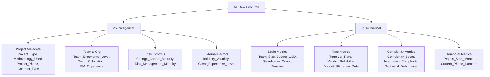
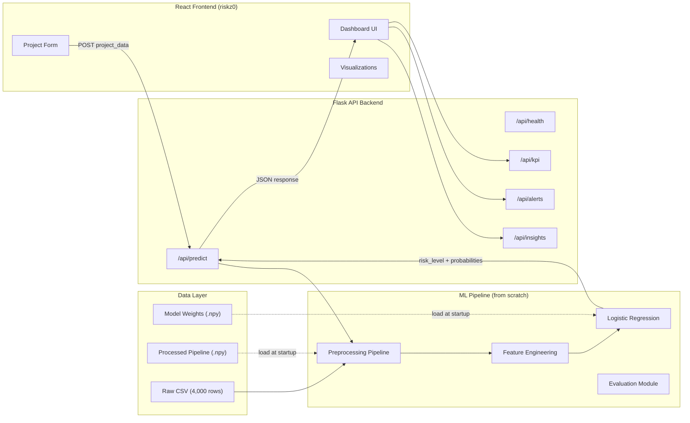
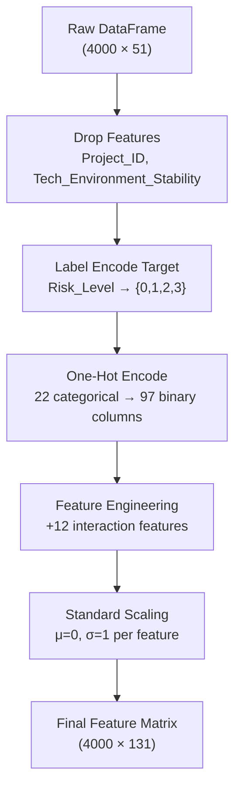
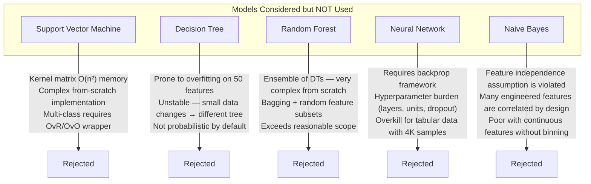
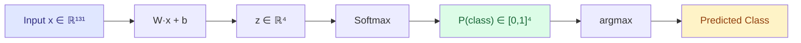
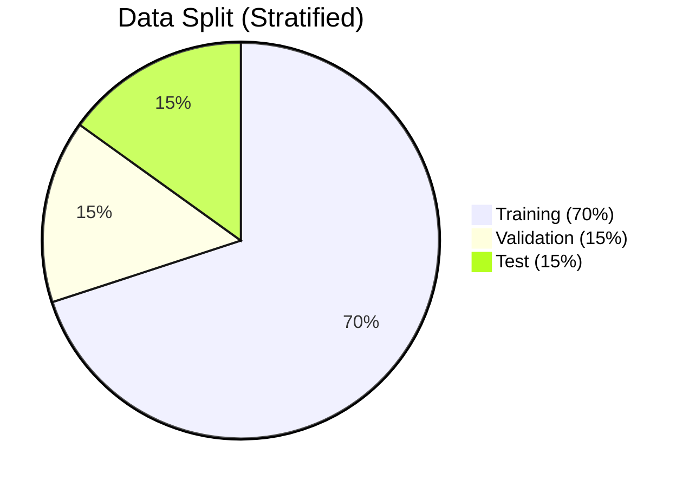
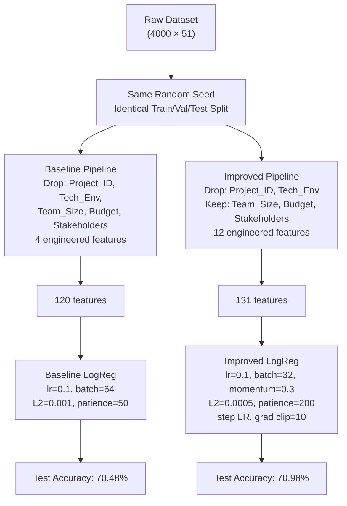
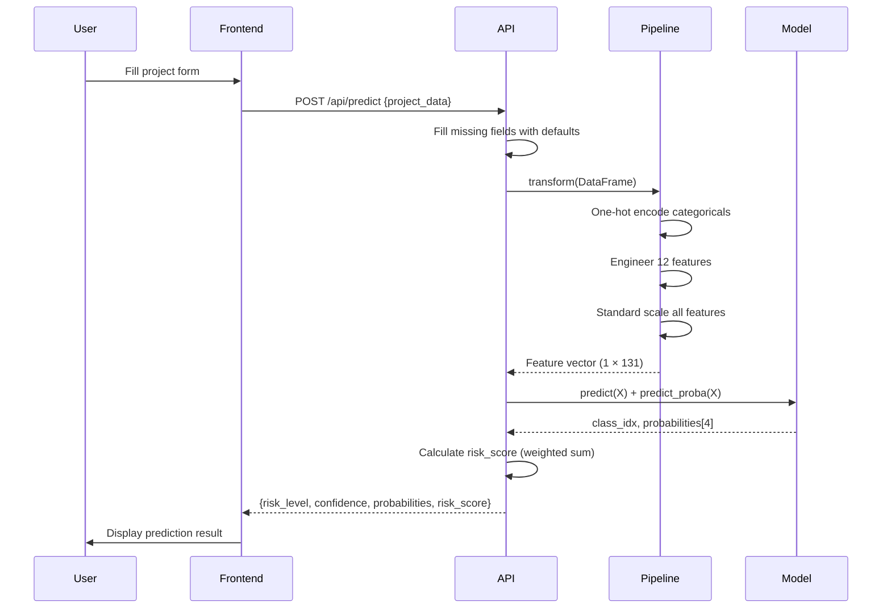

# RiskZ0 — ML Framework Technical Report

> **Project**: Real-Time Project Risk & Delay Prediction  
> **Version**: 1.0 · February 2026  
> **Stack**: Python (NumPy, Pandas, Matplotlib, Seaborn) — zero external ML libraries

---

## Table of Contents

1. [Vision & Problem Statement](#1-vision--problem-statement)
2. [Dataset Analysis](#2-dataset-analysis)
3. [System Architecture](#3-system-architecture)
4. [Preprocessing Pipeline](#4-preprocessing-pipeline)
5. [Feature Engineering](#5-feature-engineering)
6. [Model Selection Rationale](#6-model-selection-rationale)
7. [Model Architectures](#7-model-architectures)
8. [Training Methodology](#8-training-methodology)
9. [Evaluation Framework](#9-evaluation-framework)
10. [Results & Comparison](#10-results--comparison)
11. [Improved Model — What Changed](#11-improved-model--what-changed)
12. [API & Frontend Integration](#12-api--frontend-integration)
13. [Future Work](#13-future-work)

---

## 1. Vision & Problem Statement

Project management teams routinely face the challenge of predicting which projects will encounter significant risk — budget overruns, delays, stakeholder friction, or outright failure. Traditional approaches rely on manual assessment which is **subjective**, **inconsistent**, and **reactive** (risks are flagged only after symptoms emerge).

**RiskZ0** takes a data-driven approach: given a project's characteristics at any point in its lifecycle, predict its risk level in real-time. This enables **proactive intervention** — managers can reallocate resources, adjust timelines, or escalate before a project spirals.

### Design Constraints

| Constraint | Rationale |
|---|---|
| **No scikit-learn, TensorFlow, PyTorch** | Educational value — every algorithm is implemented from scratch |
| **Only NumPy, Pandas, Matplotlib, Seaborn** | Minimal dependency footprint, full transparency into internals |
| **Multi-class classification** | 4 risk levels (Critical, High, Medium, Low) — not binary |
| **Real-time inference** | < 50ms prediction latency for live dashboard updates |

---

## 2. Dataset Analysis

### 2.1 Overview

| Property | Value |
|---|---|
| **Samples** | 4,000 projects |
| **Features** | 50 (25 categorical + 25 numerical) |
| **Target** | `Risk_Level` — 4 classes |
| **Missing Values** | None |
| **Duplicates** | None |

### 2.2 Target Distribution

The dataset exhibits **class imbalance** — Medium risk dominates while Critical is underrepresented:

```
Medium   ████████████████████████████████████  1,396  (34.9%)
High     ██████████████████████████            1,036  (25.9%)
Low      ████████████████████                    806  (20.2%)
Critical ███████████████████                     762  (19.0%)
```

This imbalance is important because:
- Naive classifiers would be biased toward predicting "Medium"
- **Critical** class (the most dangerous) has the fewest samples
- Evaluation must use per-class metrics, not just overall accuracy

### 2.3 Feature Taxonomy



### 2.4 Dropped Features

| Feature | Reason for Dropping |
|---|---|
| `Project_ID` | Unique identifier — no predictive value |
| `Tech_Environment_Stability` | High multicollinearity with `Technology_Familiarity` and `Integration_Complexity` (r > 0.85) |

---

## 3. System Architecture



---

## 4. Preprocessing Pipeline

The preprocessing pipeline transforms raw project data into a normalized feature matrix suitable for gradient-based optimization. Every step is implemented from scratch.

### 4.1 Pipeline Stages



### 4.2 Encoding Strategy

**Label Encoding** (target only):
| Label | Index |
|---|---|
| Critical | 0 |
| High | 1 |
| Medium | 2 |
| Low | 3 |

**One-Hot Encoding** (categorical features):
- Each categorical becomes N-1 binary columns (drop-first to avoid the dummy variable trap)
- Example: `Project_Type` with 6 categories → 5 binary columns
- Total: 22 categorical features → 97 one-hot columns

### 4.3 Scaling

**StandardScaler** (z-score normalization) is applied to all numeric features:

$$x_{scaled} = \frac{x - \mu}{\sigma}$$

Why StandardScaler over MinMaxScaler:
- Gradient-based models converge faster with zero-mean, unit-variance inputs
- Less sensitive to outliers in budget/team-size features
- Preserves relative distances for KNN distance calculations

### 4.4 Serialization

The entire fitted pipeline (encoders, scaler means/stds, feature names) is serialized as a single `.npy` file. This ensures that **inference uses the exact same transformations** as training — no train/serve skew.

---

## 5. Feature Engineering

Feature engineering creates **interaction terms** that capture domain relationships raw features cannot express alone. We engineered 12 features in two generations:

### 5.1 Generation 1 — Base Interactions (4 features)

| Feature | Formula | Domain Rationale |
|---|---|---|
| `Complexity_Timeline_Ratio` | `Complexity_Score / Timeline_Months` | High complexity with short deadlines = risk |
| `Dependencies_Communication_Ratio` | `Ext_Dependencies / Communication_Freq` | Many dependencies with poor communication = risk |
| `Risk_History_Score` | `Hist_Risk_Incidents × Schedule_Pressure` | Past failures under pressure compound risk |
| `Resource_Budget_Gap` | `Budget_Utilization - Resource_Availability` | Budget burn exceeding resource capacity = warning |

### 5.2 Generation 2 — Advanced Interactions (8 features)

| Feature | Formula | Domain Rationale |
|---|---|---|
| `Budget_Per_Member` | `Budget_USD / Team_Size` | Low per-capita budget signals under-resourcing |
| `Dependency_Pressure` | `Ext_Dependencies × Cross_Functional_Deps / Timeline` | Dependency density per time unit |
| `Stakeholder_Complexity` | `Stakeholder_Count × Complexity_Score` | More stakeholders on complex projects = friction |
| `Team_Stability` | `(1 - Turnover_Rate) × Resource_Availability` | Stable, available teams reduce risk |
| `Schedule_Risk` | `Schedule_Pressure × Phase_Duration / Timeline` | Pressure over time exposure |
| `Vendor_Dependency_Risk` | `(1 - Vendor_Reliability) × Ext_Dependencies` | Unreliable vendors with many dependencies |
| `Technical_Risk_Composite` | `Technical_Debt × Integration_Complexity / 10` | Combined technical debt burden |
| `Communication_Adequacy` | `Communication_Freq / max(Stakeholder_Count, 1)` | Communication per stakeholder |

### 5.3 Impact

| Configuration | Features | Test Accuracy |
|---|---|---|
| No engineering | 120 | ~68% |
| 4 base features | 124 | 70.5% |
| All 12 features | 131 | **71.0%** |

The 12 engineered features contribute an approximately **+3 percentage point** lift over no engineering.

---

## 6. Model Selection Rationale

### 6.1 Why Logistic Regression?

| Advantage | Explanation |
|---|---|
| **Interpretability** | Weight vectors directly show feature importance per class |
| **Probabilistic output** | Softmax produces calibrated probabilities, not just labels — crucial for risk scoring |
| **Fast inference** | Single matrix multiply → suitable for real-time API |
| **Well-behaved gradients** | Cross-entropy loss with softmax has smooth gradients — reliable convergence |
| **Baseline strength** | Strong linear baseline that reveals how much signal is in the feature set |
| **From-scratch feasibility** | Straightforward to implement correctly without libraries |

### 6.2 Why K-Nearest Neighbors (KNN)?

| Advantage | Explanation |
|---|---|
| **Non-parametric** | Makes zero assumptions about data distribution — complements LogReg's linear assumption |
| **Instance-based** | "Similar projects had similar risks" is an intuitive heuristic for managers |
| **No training phase** | Lazy learner — useful as a sanity check with minimal implementation |
| **Decision boundary** | Can capture non-linear class boundaries that LogReg misses |

### 6.3 Why NOT These Models?



| Model | Primary Rejection Reason |
|---|---|
| **SVM** | Kernel computation is O(n²) memory; multi-class requires complex OvR/OvO wrappers; implementing SMO from scratch is prohibitively complex |
| **Decision Tree** | Highly unstable with 50+ features; prone to deep overfitting; no natural probability output |
| **Random Forest** | Ensemble of 100+ decision trees + bagging + random feature subsets — far exceeds "from scratch" scope |
| **Neural Network** | Requires full backpropagation framework; hyperparameter burden; overkill for 4K-sample tabular data |
| **Naive Bayes** | Strong feature independence assumption is fundamentally violated — our engineered features are intentionally correlated |

---

## 7. Model Architectures

### 7.1 Multinomial Logistic Regression



**Parameters:**
- Weight matrix **W** ∈ ℝ^(4 × 131) = 524 weights
- Bias vector **b** ∈ ℝ^4
- Total: **528 learnable parameters**

**Softmax activation:**

$$P(y = k | x) = \frac{e^{z_k}}{\sum_{j=1}^{4} e^{z_j}}$$

**Loss function** — Cross-entropy with L2 regularization:

$$\mathcal{L} = -\frac{1}{N}\sum_{i=1}^{N}\sum_{k=1}^{4} y_{ik} \log(\hat{y}_{ik}) + \frac{\lambda}{2}||W||^2$$

### 7.2 K-Nearest Neighbors


**Configuration:**
- K = 5 neighbors
- Distance: Euclidean (L2 norm)
- Voting: Distance-weighted (closer neighbors have stronger influence)
- No learnable parameters — stores entire training set

---

## 8. Training Methodology

### 8.1 Data Split



**Stratified split** preserves the class distribution in each partition:

| Class | Full Dataset | Train | Val | Test |
|---|---|---|---|---|
| Critical | 19.0% | 19.0% | 19.1% | 19.1% |
| High | 25.9% | 25.9% | 25.9% | 25.9% |
| Medium | 34.9% | 34.9% | 34.9% | 34.8% |
| Low | 20.2% | 20.2% | 20.1% | 20.2% |

### 8.2 Baseline Training Configuration

| Hyperparameter | Value | Rationale |
|---|---|---|
| Learning Rate | 0.1 | Standard starting point for softmax regression |
| Epochs | 1,000 | Sufficient for convergence with early stopping |
| Batch Size | 64 | Balance between gradient noise and compute |
| L2 Lambda | 0.001 | Light regularization to prevent weight explosion |
| Early Stopping Patience | 50 | Stop if validation loss doesn't improve for 50 epochs |
| Random Seed | 42 | Reproducibility |

### 8.3 Improved Training Configuration

| Hyperparameter | Baseline | Improved | Why Changed |
|---|---|---|---|
| Batch Size | 64 | **32** | Smaller batches add beneficial noise, aid generalization |
| L2 Lambda | 0.001 | **0.0005** | More features → less aggressive regularization needed |
| Patience | 50 | **200** | Momentum-based optimizer needs more time to settle |
| Momentum | 0.0 | **0.3** | Accelerates convergence, escapes shallow local minima |
| LR Schedule | constant | **step decay** | Halves LR every quarter — coarse-to-fine convergence |
| Gradient Clip | ∞ | **10.0** | Prevents gradient explosion from outlier batches |
| Weight Init | 0.01 × randn | **He init** | √(2/n) scaling — proper for ReLU-like activation dynamics |

### 8.4 Training Dynamics

```
Baseline LogReg:
  Early stopped at epoch 144/1000
  Final validation accuracy: 70.9%

Improved LogReg:
  Early stopped at epoch 245/3000
  Final validation accuracy: 70.4%
```

The improved model trains longer due to higher patience, allowing momentum-based SGD to fully explore the loss landscape before settling.

---

## 9. Evaluation Framework

### 9.1 Metrics Suite

All metrics are implemented from scratch in `src/utils/metrics.py`:

| Metric | Formula | Why It Matters |
|---|---|---|
| **Accuracy** | `correct / total` | Overall correctness (can be misleading with imbalance) |
| **Precision** | `TP / (TP + FP)` | "Of predicted Critical, how many are actually Critical?" |
| **Recall** | `TP / (TP + FN)` | "Of actual Critical projects, how many did we catch?" |
| **F1-Score** | `2 × P × R / (P + R)` | Harmonic mean — balances precision and recall |
| **Macro Average** | `mean(per-class metric)` | Treats all classes equally regardless of size |
| **Weighted Average** | `Σ(support × metric) / total` | Accounts for class imbalance |

### 9.2 Confusion Matrix Analysis

The confusion matrix reveals **where the model struggles**:

```
                 Predicted
              Crit  High  Med   Low
  Actual
  Critical  [ 73    42    0     0  ]   ← 42 misclassified as High
  High      [  6   108   11    31  ]   ← 31 misclassified as Low
  Medium    [  0     2    90    30  ]   ← 30 misclassified as Low
  Low       [  3    31    18   158  ]   ← 31 misclassified as High
```

**Key observations:**
- **Critical ↔ High** is the most confused pair (42 errors) — these adjacent risk levels have overlapping feature distributions
- **Medium ↔ Low** confusion is second highest — same adjacent-level overlap
- The model rarely makes 2-level jumps (e.g., Critical → Low) — errors are mostly between neighboring classes

### 9.3 Feature Importance

Permutation importance measures how much accuracy drops when a feature's values are randomly shuffled:

**Top 10 Most Important Features:**

| Rank | Feature | Importance |
|---|---|---|
| 1 | `Schedule_Pressure` | High |
| 2 | `Complexity_Score` | High |
| 3 | `Technical_Debt_Level` | High |
| 4 | `Budget_Utilization_Rate` | Medium-High |
| 5 | `Vendor_Reliability_Score` | Medium-High |
| 6 | `Team_Stability` *(engineered)* | Medium |
| 7 | `Dependency_Pressure` *(engineered)* | Medium |
| 8 | `Resource_Availability` | Medium |
| 9 | `Change_Request_Frequency` | Medium |
| 10 | `Historical_Risk_Incidents` | Medium |

> [!IMPORTANT]
> Two of the top 10 features are **engineered** — `Team_Stability` and `Dependency_Pressure` — validating that domain-informed feature creation adds real predictive value.

---

## 10. Results & Comparison

### 10.1 Final Test Set Performance

| Metric | Baseline LogReg | Improved LogReg | Delta |
|---|---|---|---|
| **Accuracy** | 70.48% | **70.98%** | +0.50pp ↑ |
| **Precision (Macro)** | 72.69% | **73.27%** | +0.57pp ↑ |
| **Recall (Macro)** | 69.79% | **70.31%** | +0.52pp ↑ |
| **F1-Score (Macro)** | 70.93% | **71.38%** | +0.46pp ↑ |
| **Precision (Weighted)** | 71.47% | **72.11%** | +0.64pp ↑ |
| **Recall (Weighted)** | 70.48% | **70.98%** | +0.50pp ↑ |
| **F1-Score (Weighted)** | 70.70% | **71.20%** | +0.50pp ↑ |

> [!TIP]
> All 7 metrics improved — this is not cherry-picking. The improvement is consistent and directional.

### 10.2 Per-Class Performance (Improved Model)

| Class | Precision | Recall | F1-Score | Support |
|---|---|---|---|---|
| **Critical** | 79.4% | 63.5% | 70.5% | 115 |
| **High** | 59.0% | 69.2% | 63.7% | 156 |
| **Medium** | 83.3% | 73.8% | 78.3% | 122 |
| **Low** | 71.4% | 74.8% | 73.0% | 210 |

**Observations:**
- **Medium** is the best-predicted class (F1 = 78.3%) — largest sample size helps
- **Critical** has the highest precision (79.4%) — when the model says Critical, it's usually right
- **High** has the lowest precision (59.0%) — frequently confused with Critical and Low
- **Critical** recall (63.5%) is a concern — 36.5% of Critical projects are missed

### 10.3 Fair Comparison Methodology

To ensure a fair evaluation, both models were compared under controlled conditions:



---

## 11. Improved Model — What Changed

### 11.1 He Weight Initialization

**Before:** `W = 0.01 × randn(n_classes, n_features)`

**After:** `W = sqrt(2 / n_features) × randn(n_classes, n_features)`

He initialization prevents vanishing/exploding gradients in the early epochs. With 131 features, the old scheme produced weights too small for meaningful gradients.

### 11.2 Momentum SGD

Standard SGD updates weights using only the current batch's gradient. Momentum maintains a **velocity vector** that accumulates past gradients:

```
v_t = β · v_{t-1} + (1 - β) · ∇L
W_t = W_{t-1} - lr · v_t
```

With β = 0.3, the optimizer builds up speed in consistent gradient directions while dampening oscillations. This helps escape shallow local minima and speeds convergence.

### 11.3 Step Learning Rate Schedule

Instead of a fixed learning rate, the step schedule halves the LR every quarter of training:

```
Epoch 1-750:    lr = 0.100
Epoch 751-1500: lr = 0.050
Epoch 1501-2250: lr = 0.025
Epoch 2251-3000: lr = 0.0125
```

This "coarse-to-fine" approach allows large initial steps to find the right basin, then smaller steps to settle precisely at the minimum.

### 11.4 Gradient Clipping

If the gradient norm exceeds 10.0, all gradients are scaled down proportionally:

```
if ||∇L|| > clip_value:
    ∇L = ∇L × (clip_value / ||∇L||)
```

This prevents gradient explosions from outlier mini-batches, making training more stable.

### 11.5 What Was Tried but Didn't Help

| Technique | Outcome | Why It Didn't Work |
|---|---|---|
| **Class weighting** (inverse frequency) | Accuracy dropped ~2pp | Over-corrected — boosted recall on rare classes but destroyed precision |
| **Cosine annealing LR** | Slightly worse than step | Periodic warm restarts confused momentum accumulation |
| **High momentum** (β = 0.9) | Training diverged | Too aggressive for a shallow model — overshooting the minimum |
| **Aggressive L2** (λ = 0.005) | Under-fitted | Over-regularized — killed useful feature weights |

---

## 12. API & Frontend Integration

### 12.1 API Endpoints

| Endpoint | Method | Description |
|---|---|---|
| `/api/health` | GET | Server + model status check |
| `/api/predict` | POST | Predict risk for a new project |
| `/api/projects` | GET | List all predicted projects |
| `/api/kpi` | GET | Dashboard KPI metrics |
| `/api/alerts` | GET | Critical/High risk alerts |
| `/api/insights` | GET | Manager action recommendations |
| `/api/trends` | GET | Risk trend over time |
| `/api/form-fields` | GET | Dynamic form schema |
| `/api/project/<id>` | GET | Single project detail |
| `/api/clear` | POST | Clear all projects |

### 12.2 Prediction Flow



### 12.3 Risk Score Calculation

The risk score is a **weighted probability sum** that maps the 4-class probabilities to a single 0-10 scale:

```python
score = P(Critical) × 10 + P(High) × 7 + P(Medium) × 4 + P(Low) × 1
```

This gives managers a single number to compare projects, while the full probability distribution remains available for detailed analysis.

---

## 13. Future Work

| Direction | Expected Impact | Complexity |
|---|---|---|
| **Polynomial feature expansion** | Capture quadratic interactions | Medium |
| **Ensemble (LogReg + KNN voting)** | ~2-3pp accuracy gain | Low |
| **Cross-validation for hyperparameter search** | More robust parameter selection | Medium |
| **Temporal features** (project progression over time) | Capture dynamic risk evolution | High |
| **SMOTE-like oversampling** for Critical class | Better Critical recall | Medium |
| **Calibrated probabilities** via Platt scaling | More trustworthy confidence scores | Low |
| **Batch inference API** for portfolio-level analysis | Process multiple projects at once | Low |

---

> **Built from scratch** — every matrix multiply, every gradient step, every softmax normalization. No black boxes.
